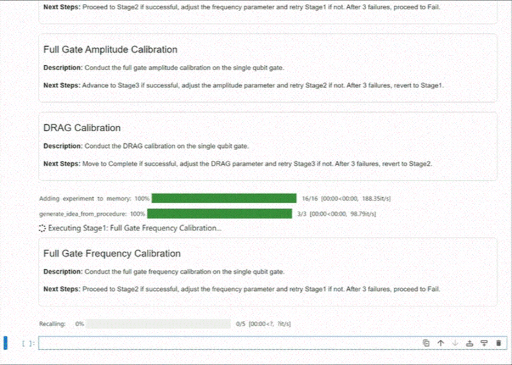
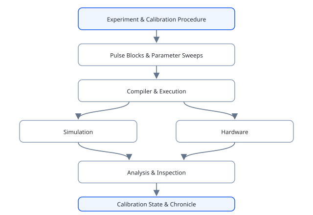

# LeeQ

**Experiment orchestration and autonomous calibration for superconducting quantum systems.**

[](https://github.com/ShuxiangCao/LeeQ/actions/workflows/test.yml)
[](https://shuxiang.scao.me/LeeQ/)
[](https://github.com/ShuxiangCao/LeeQ/pkgs/container/leeq)
[](LICENSE)

LeeQ is a Python framework for defining, executing, and analyzing pulse-level quantum experiments. It was built for superconducting-circuit research, where experiments must connect reusable pulse sequences, parameter sweeps, calibration state, hardware control, simulation, and scientific analysis.

Unlike a circuit-level SDK, LeeQ focuses on the laboratory workflow around the quantum processor: characterize a device, update its calibration, preserve the experimental context, and compose the next experiment.

<!-- Replace this static preview with a clean, animated recording when available. -->
<p align="center">
  
</p>

## Why LeeQ?

- **Experiment-native API:** express pulse sequences, measurements, and multidimensional parameter sweeps as reusable Python objects.
- **Calibration workflows:** run spectroscopy, Rabi, Ramsey, DRAG, readout calibration, benchmarking, tomography, and multi-qubit tune-up routines.
- **Simulation-to-hardware path:** develop against virtual transmon models, then connect the same experiment abstractions to laboratory control systems, including QubiC.
- **Agent-ready experiments:** expose structured experiment descriptions and text/visual inspection hooks through the k-agents integration.
- **Reproducible sessions:** track experiment inputs, outputs, and calibration changes with the integrated Chronicle layer.

## Quick start

### Run the Docker environment

```bash
docker run --rm \
  -p 8888:8888 \
  -p 8050:8050 \
  -v /path/to/local/folder:/home/jovyan/work \
  ghcr.io/shuxiangcao/leeq:latest
```

Open `http://localhost:8888` for Jupyter. Port `8050` is available for live plotting.

### Install from source

LeeQ requires Python 3.10 or newer.

```bash
git clone https://github.com/ShuxiangCao/LeeQ.git
cd LeeQ
python -m venv .venv
source .venv/bin/activate
python -m pip install --upgrade pip
python -m pip install -e .
```

Then follow the [10-minute simulated experiment](docs/quick_start.md) to run a Rabi calibration without laboratory hardware.

## How it fits together

<p align="center">
  
</p>

LeeQ keeps experiment logic separate from execution backends. This makes it possible to develop and test workflows in simulation while preserving the abstractions needed for real instruments.

## Included workflows

| Area | Examples |
| --- | --- |
| Single-qubit calibration | resonator and qubit spectroscopy, Rabi, Ramsey, DRAG, ping-pong amplitude refinement |
| Characterization | T1, T2, randomized benchmarking, assignment matrices |
| Multi-qubit control | conditional Stark calibration, Hamiltonian tomography, two-qubit tune-up |
| Analysis | fitting, plotting, tomography, optimal control, inspection hooks |
| Infrastructure | virtual devices, QubiC compilation, and Chronicle session tracking |

Explore the runnable notebooks:

- [Simulation and tune-up](notebooks/SimulatedSystem)
- [Calibration agents](notebooks/Agent)
- [Tutorial series](notebooks/tutorials)
- [Characterization and calibration workflows](notebooks/workflows)
- [Focused experiment examples](notebooks/examples)

## Documentation

- [Documentation site](https://shuxiang.scao.me/LeeQ/)
- [Installation guide](docs/getting-started/installation.md)
- [Core concepts](docs/guide/concepts.md)
- [Experiment guide](docs/guide/experiments.md)
- [Calibration guide](docs/guide/calibrations.md)
- [Architecture overview](docs/development/architecture.md)

## Development

```bash
python -m pip install -r requirements-dev.txt
python -m pip install -e .
pytest tests/
```

See the [contributing guide](docs/development/contributing.md) for the development workflow. Pull requests and issue reports are welcome.

## Project status

LeeQ is research software under active development. It has been used to develop and operate superconducting-qubit experiments, but APIs may continue to evolve as new hardware and autonomous-experimentation workflows are added.

## Acknowledgement

LeeQ was created by [Shuxiang Cao](https://github.com/ShuxiangCao) at the University of Oxford's [Quantum Superconducting Circuits Research Group](https://leeklab.org/).

## License

LeeQ is available under the [BSD 3-Clause License](LICENSE).
